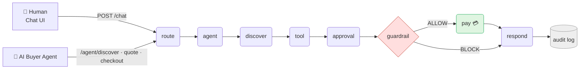
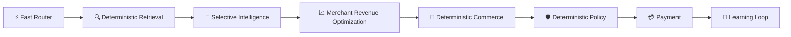

<div align="center">

# 🛒 GrowthMate

### AI Growth & Agentic Commerce Agent

**A merchant-side AI agent, transactable by humans *and* other AI agents — where every money-moving action is deterministic, bounded, and audited.**

[](https://www.python.org/)
[](https://fastapi.tiangolo.com/)
[](https://www.langchain.com/langgraph)
[](https://razorpay.com/)
[](#testing)


[Features](#-features) • [Architecture](#-architecture) • [Quick Start](#-quick-start) • [Demo](#-demo-journeys) • [API](#-api-surface) • [Contributing](#-contributing)

</div>

<!-- <br>

<div align="center">


<sub>📸 Replace this with a real screenshot or GIF of `/static/index.html` and `/static/audit.html` before publishing.</sub>
</div>

<br> -->

---

## 📌 About

GrowthMate is a **merchant-growth commerce agent**, not a generic shopping chatbot. It sits on Razorpay's test-mode payment rails and can be transacted with by:

- 🧑 a **human**, through a chat UI, or
- 🤖 an **autonomous AI buyer agent**, through a machine-readable REST + capability-manifest interface

...with the same non-negotiable guarantee either way: **an LLM never decides how money moves.** Cart math, quoting, approval, spend limits, and payment execution are all plain deterministic Python — unit-testable in total isolation from any model.

> **The bar this was built to clear:** every money action explainable, bounded, and gated. Show the audit trail. Show one failure handled gracefully.

## ✨ Features

- **🧠 Selective intelligence** — a fast deterministic router handles most turns; an LLM is only invoked when ambiguity genuinely requires it.
- **🛡️ Fail-closed guardrails** — explicit approval, quote↔cart integrity (SHA-256 hash + version), and per-actor spend limits all have to pass, in order, before a rupee moves.
- **🔒 Tamper-evident mandates** — every approved transaction is signed with an HMAC-SHA256 mandate binding session, actor, cart hash, amount, and quote id.
- **🎯 Merchant Capture Engine** — external market discovery informs intent, but a deterministic scoring engine decides whether the merchant catalog can actually fulfill it, rather than blindly reselling market listings.
- **📈 Next-Best-Offer Engine** — cross-sell/upsell suggestions chosen by expected incremental revenue, under a strict "buyer friction" budget (never more than one offer per turn).
- **🌐 Agent-native commerce** — a full `/agent/*` REST surface and a `/.well-known/agent-commerce.json` capability manifest let an *external* AI buyer discover, quote, and check out without a human in the loop.
- **📋 Full audit trail** — every cart mutation, approval, block, and payment gets its own row with a `trace_id`, viewable live in an audit dashboard.
- **⚡ Latency-aware cascade routing** — cheap turns (greetings, cart view, catalog browse) skip the LLM and discovery entirely — but are structurally incapable of reaching the payment path.

## 🏗️ Architecture

A single deterministic forward pass through a LangGraph pipeline for **every** turn — human or agent, chat or REST. No agent↔tool loop, no LLM deciding what to call next.





<details>
<summary><b>📎 More diagrams &amp; full design docs</b></summary>
<br>

See [`docs/ARCHITECTURE.md`](docs/ARCHITECTURE.md) for the full system diagram and dual-plane (intelligence vs. deterministic-commerce) design, and [`docs/LOW_LEVEL_DESIGN.md`](docs/LOW_LEVEL_DESIGN.md) for exact schemas, LangGraph node signatures, and API contracts.

</details>

## 🧰 Tech Stack

| Layer | Choice |
|---|---|
| API | FastAPI + Pydantic |
| Agent orchestration | LangGraph + LangChain (Google Gemini) |
| Database | SQLAlchemy + SQLite |
| Payments | Razorpay (test mode) |
| External discovery | SerpAPI, with an offline mock fallback |
| Semantic search | Dependency-free hashing-trick embeddings + cosine similarity |
| Testing | pytest + httpx (fully mocked — no live keys needed to run the suite) |

## 📁 Project Structure

<details>
<summary>Click to expand</summary>

```
app/
├── main.py                FastAPI app, routes, startup checks
├── orchestration.py        LangGraph pipeline (route → agent → discover →
│                           tool → approval → guardrail → pay → respond → audit)
├── cascade_router.py       Tiered fast-path dispatch (never reaches payment)
├── router.py               Deterministic intent classification
├── discovery.py            Async SerpAPI / offline mock product search
├── semantic_cache.py       Similarity + freshness cache in front of discovery
├── embeddings.py           Hashing-trick vectors + cosine similarity
├── merchant_capture.py     Scores merchant-catalog fulfillment fit
├── offer_engine.py         Next-Best-Offer cross-sell/upsell picker
├── commerce.py             Cart mutation, checkout preview, order creation
├── quote.py                Immutable backend-owned quote (cart hash + TTL)
├── guardrail.py            Approval / quote integrity / spend-limit checks
├── mandate.py              HMAC-SHA256 signing of approved transactions
├── razorpay_client.py      Payment link creation + webhook verification
├── pii.py                  Redacts sensitive data before any LLM call
├── models.py / schemas.py  SQLAlchemy models + Pydantic schemas
└── db.py / config.py       DB session + env-driven configuration

frontend/     Chat UI + live audit trail viewer
docs/         ARCHITECTURE.md · HIGH_LEVEL_DESIGN.md · LOW_LEVEL_DESIGN.md
tests/        pytest suite — guardrail, cascade router, mandate, merchant capture…
buyer_agent.py  Standalone AI buyer demo (plain `requests`, separate process)
```

</details>

## 🚀 Quick Start

```bash
git clone <this-repo-url>
cd GrowthMate---AI-Sales-Agent

python -m venv venv
source venv/bin/activate          # Windows: venv\Scripts\activate

pip install -r requirements.txt
cp .env.example .env              # fill in your own keys — see below

uvicorn app.main:app --reload
```

The database starts empty — the agent populates products from live SERP discovery at runtime, added to the cart as payable `EXT-xxx` items. No seed step required.

| URL | What it is |
|---|---|
| `/health` | Liveness check |
| `/docs` | Interactive OpenAPI docs |
| `/static/index.html` | Chat UI |
| `/static/audit.html` | Live audit trail viewer |

### Environment variables

| Key | Required | Purpose |
|---|:---:|---|
| `MANDATE_SECRET` | ✅ | HMAC secret for signing approved transactions — the app won't boot without it |
| `RAZORPAY_KEY_ID` / `RAZORPAY_KEY_SECRET` | ✅ | Razorpay test-mode credentials |
| `DATABASE_URL` | – | Defaults to local SQLite |
| `GEMINI_API_KEY` | – | Enables LLM-assisted requirement extraction |
| `SERPAPI_KEY` | – | Enables live external product discovery |

> Never commit `.env`. Generate your own `MANDATE_SECRET` and keys locally.

## 🎬 Demo Journeys

**Journey A — a normal purchase:** ask the chat UI for a product, pick a result, say "checkout," approve the quoted total, and receive a real Razorpay **test** payment link — then watch the `ALLOW` row land in the audit viewer.

**Journey B — an engineered failure:**

```bash
python buyer_agent.py
```

An autonomous buyer agent deliberately requests a quantity that exceeds its per-transaction limit. The result is a clean, structured refusal — `HTTP 200`, `"blocked": true` — never an exception, never a silent charge. The audit viewer shows the exact block reason and confirms no order or payment was created.

## 🔌 API Surface

| Endpoint | Purpose |
|---|---|
| `POST /chat` | Human conversational turn |
| `GET /catalog` | Merchant catalog |
| `GET /audit` | Queryable audit log |
| `GET /.well-known/agent-commerce.json` | Machine-readable merchant capability manifest |
| `POST /agent/discover` \| `/agent/quote` \| `/agent/checkout` | Agent-to-agent commerce, same guardrails as `/chat` |
| `GET /agent/order/{order_id}` | Order status |
| `GET /metrics/latency` | Stage-level P50/P95 latency |
| `POST /webhook/razorpay` | HMAC-verified payment webhook |

## 🛡️ Money-Safety Model

Before any payment executes, three deterministic checks must all pass, in order:

1. **Approval** — an explicit, unambiguous "yes" against a *shown* checkout preview
2. **Quote integrity** — the cart's current hash and version must still match the quoted snapshot
3. **Spend limits** — per-transaction and per-session caps, enforced per actor

Only then is the transaction HMAC-signed and sent to Razorpay. Every block is expected control flow, fully logged, and never a crash.

## 🧪 Testing

```bash
pytest
```

The full suite runs against mocked network calls and an in-memory database — no live API keys required.

## ☁️ Deployment

Deploys as a modular monolith on **Render**:

```
uvicorn app.main:app --host 0.0.0.0 --port $PORT
```

## 📚 Documentation

| Doc | Covers |
|---|---|
| [`docs/ARCHITECTURE.md`](docs/ARCHITECTURE.md) | System design & integrations |
| [`docs/HIGH_LEVEL_DESIGN.md`](docs/HIGH_LEVEL_DESIGN.md) | Module boundaries & data flow |
| [`docs/LOW_LEVEL_DESIGN.md`](docs/LOW_LEVEL_DESIGN.md) | Schemas, contracts, guardrail rules |
| [`PHASE_NOTES.md`](PHASE_NOTES.md) | Implementation deviations, phase by phase |

