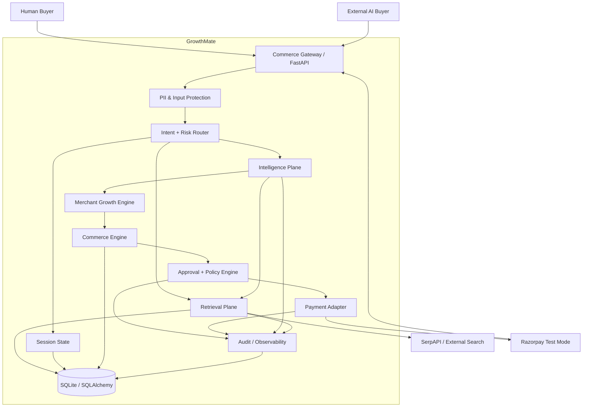

# GrowthMate — Target Architecture

## 1. Executive Summary

GrowthMate is a merchant-side agentic commerce platform designed for Razorpay test-mode APIs. Its purpose is not to behave like a generic shopping chatbot; it should **increase merchant revenue while making the merchant transact-able by human and AI buyers**.

The target system follows one principle:

> **Use AI only where ambiguity, intent, or adaptation require intelligence. Use deterministic systems for retrieval policy, pricing, cart math, approval, risk, and money movement.**

The target pipeline is:

```text
UNDERSTAND → RETRIEVE → DISCOVER → CAPTURE → OPTIMIZE → QUOTE → APPROVE → GUARD → PAY → LEARN
```

The differentiating mechanism is the **Merchant Capture Engine**. External discovery is used to understand what the buyer wants and to establish a market reference. The system does not blindly put external products into the payable cart. Instead, it maps the external intent to the best fulfillable merchant SKU using semantic fit, price fit, availability, stock, merchant economics, and offer potential. This converts a pure shopping assistant into a merchant-growth system.

The second differentiator is the **Next Best Offer Engine**, which chooses at most a bounded number of cross-sell/upsell offers using expected incremental revenue and a friction budget rather than hard-coded category adjacency.

The third differentiator is **agent-readable commerce**: an external AI buyer can discover merchant capabilities, obtain a signed/bounded quote, request checkout, and query order status without depending on the human UI.

---

## 2. Design Goals

### Functional goals

1. Understand conversational buyer intent.
2. Ask clarification questions only when necessary.
3. Retrieve relevant merchant products quickly.
4. Use external live discovery selectively through SerpAPI when market context is needed.
5. Cache semantically similar external searches to avoid repeated SerpAPI latency.
6. Map external market candidates to merchant-fulfillable products.
7. Recommend the merchant product that best satisfies the buyer while protecting conversion.
8. Recommend complementary merchant products using expected incremental revenue.
9. Keep cart, totals, discounts, limits, and payment amounts deterministic.
10. Require explicit approval for money actions.
11. Enforce transaction/session limits independently of the LLM.
12. Produce an audit trail for all material pipeline decisions.
13. Handle dependency failures gracefully.
14. Support both human buyers and external AI buyers.
15. Learn from recommendation, offer, cart, checkout, payment, and abandonment events.

### Latency goals

The exact target must be measured rather than asserted, but the implementation should aim for:

```text
Fast path, catalog-only, cache HIT:      < 500 ms P50
Normal path, one intelligence call:      < 1.5 s P50
Live discovery path:                     minimize non-LLM waiting; parallelize I/O
P95:                                      measured and reported per stage
```

The project must expose stage-level latency so the team can demonstrate where time is spent.

### Safety goals

No LLM response, tool call, or prompt is trusted for:

- final cart total
- payable amount
- approval state
- transaction limits
- actor authorization
- quote validity
- cart integrity
- payment execution decision

---

## 3. Current Baseline vs Target

The repository already contains:

- FastAPI
- SQLAlchemy + SQLite
- LangGraph
- Gemini
- SerpAPI-shaped discovery code
- Razorpay test-mode integration
- deterministic guardrail functions
- audit log
- cart/order models
- human chat UI
- external buyer script

The target architecture should **retain the useful deterministic foundations** while changing the orchestration model.

### Major changes

| Current behavior | Target behavior |
|---|---|
| Gemini orchestrates most turns | Lightweight deterministic router first; LLM only on ambiguous/complex paths |
| Gemini can be called again after tool execution just to verbalize results | Deterministic response composer for structured results; one LLM call only when generation adds value |
| External candidates may be placed into the mixed payable cart | Only merchant-fulfillable SKUs become payable cart items |
| Hard-coded category adjacency | Revenue-aware Next Best Offer Engine |
| SerpAPI is the main discovery dependency | Semantic cache → merchant catalog retrieval → SerpAPI fallback/widening |
| Synchronous outbound search | Async I/O and parallel retrieval where dependencies are independent |
| Conversation history sent broadly | Compact session state + selective context |
| Approval is largely text-pattern based | Approval is tied to a specific quote/cart version and validated fail-closed |
| Transaction guardrail only checks amount and spend | Quote integrity + actor + amount + velocity/session + cart version checks |
| Audit focuses on pipeline events | Audit becomes a decision ledger with confidence, source, cache, score, quote hash, and latency |
| Human UI is primary | Human UI + formal agent-commerce API surface |

---

## 4. Target System Context



---

## 5. Dual-Plane Architecture

### 5.1 Intelligence plane

The intelligence plane handles:

- intent extraction
- ambiguity resolution
- semantic classification
- semantic retrieval
- market interpretation
- merchant capture scoring
- offer selection
- response generation where needed

### 5.2 Deterministic commerce plane

The deterministic plane handles:

- merchant catalog filtering
- inventory validation
- cart mutation
- price calculation
- quote creation
- cart hashing
- approval state validation
- guardrails
- payment execution
- webhook verification
- order persistence

This separation is intentional. It prevents the system from becoming slower and less reliable because an LLM is asked to perform tasks the backend can solve exactly.

---

## 6. Request Routing Strategy

The router should classify requests before invoking Gemini.

```text
Request
  ↓
Input validation / PII layer
  ↓
Fast semantic + rule classifier
  ↓
┌──────────────────────────────────────────────┐
│ intent / domain / category / complexity      │
│ risk / live-search-needed / action-needed    │
│ confidence                                    │
└──────────────────────────────────────────────┘
  ↓
confidence gate
  ├── HIGH → deterministic or lightweight path
  ├── MEDIUM → one lightweight LLM call
  └── LOW / COMPLEX → stronger reasoning path
```

Example classification:

```json
{
  "intent": "purchase",
  "domain": "commerce",
  "category": "footwear",
  "complexity": "low",
  "risk": "medium",
  "requires_live_search": false,
  "requires_merchant_catalog": true,
  "action": "recommend",
  "confidence": 0.97
}
```

---

## 7. Retrieval Architecture

RAG should be used primarily for **merchant knowledge and semantic catalog retrieval**, not as a replacement for current market facts.

### 7.1 Merchant catalog retrieval

Store product embeddings over:

- name
- description
- category
- use cases
- features
- compatibility
- buyer-facing benefits
- structured metadata

Retrieve top-K merchant candidates using semantic similarity, then apply deterministic hard filters for:

- stock
- currency
- price ceiling
- required attributes
- policy restrictions

For the current hackathon scale, embeddings can live in application memory or in a small SQLite-backed representation. A production path can move to Postgres + pgvector without changing the interface.

### 7.2 External search semantic cache

The semantic cache sits before SerpAPI:

```text
normalized intent
  ↓
embedding
  ↓
nearest cached searches
  ↓
freshness + similarity checks
  ├── valid HIT → reuse normalized candidates
  └── MISS → SerpAPI
```

A cache entry should include:

- normalized query
- query embedding
- structured requirements
- normalized candidates
- source
- retrieved_at
- expires_at
- quality score

Do not serve stale data blindly for price-sensitive checkout. Cached external results are **market intelligence**, not authoritative merchant prices.

---

## 8. External Discovery Strategy

External discovery is optional, not mandatory.

Use it when:

- the buyer asks for market alternatives
- the merchant catalog has weak coverage
- market benchmarking improves recommendation quality
- the router classifies the request as requiring live data

Do not use it when:

- the buyer explicitly selects a known merchant SKU
- a simple cart operation is requested
- a payment/checkout operation only needs the current cart
- a valid semantic cache result is sufficiently fresh

### Waterfall

```text
Semantic cache
   ↓ miss / stale
Merchant semantic retrieval
   ↓ insufficient coverage
SerpAPI
   ↓ failure
Fresh cached external results
   ↓ unavailable
Merchant-only fallback
```

This is a **quality-first waterfall**, not a blind cache shortcut.

---

## 9. Merchant Capture Engine

This is the primary merchant-growth differentiator.

External results identify the buyer's market intent. They do not automatically become payable items.

For each external candidate, retrieve merchant candidates and calculate:

```text
Merchant Capture Score =
    semantic_fit
  + requirement_fit
  + price_affinity
  + stock_score
  + availability_score
  + conversion_prior
  + expected_attach_value
  + merchant_priority
```

Weights should be configuration-driven.

Output:

```json
{
  "external_reference": "market-candidate-1",
  "merchant_sku": "SHOE-001",
  "score": 0.93,
  "reason_codes": [
    "same_use_case",
    "within_budget",
    "in_stock",
    "high_semantic_fit"
  ],
  "explanation": "Closest merchant-fulfillable match within the buyer budget."
}
```

The system should explicitly distinguish:

```text
market recommendation
vs
merchant recommendation
```

This gives a defensible story to judges: GrowthMate knows what is available in the market but optimizes the actual transaction toward what the merchant can fulfill.

---

## 10. Next Best Offer Engine

After identifying the base merchant product, generate complementary candidates from the merchant catalog.

For each candidate calculate expected incremental revenue:

```text
Expected Incremental Revenue =
    P(accept offer)
  × incremental contribution margin
  × inventory confidence
  - discount cost
  - friction penalty
```

Then apply a buyer friction budget:

- maximum offers per interaction
- maximum total add-on amount as a percentage of base basket
- no offer if confidence is below threshold
- no offer if stock is low or the product conflicts with requirements

Output:

```json
{
  "offer_sku": "SOCK-001",
  "accept_probability": 0.61,
  "incremental_margin": 180,
  "expected_incremental_revenue": 109.8,
  "reason": "Frequently paired with the selected footwear category."
}
```

Start with a transparent heuristic model. Later, it can be replaced by a contextual bandit without changing the API.

---

## 11. Agent-Commerce Interface

Expose a machine-readable merchant capability document and machine-friendly APIs.

### Capability document

```text
GET /.well-known/agent-commerce.json
```

It should advertise:

- merchant identity
- currency
- supported capabilities
- discover endpoint
- quote endpoint
- checkout endpoint
- order status endpoint
- supported actors
- policy/transaction limits where safe to disclose

### Agent endpoints

```text
POST /agent/discover
POST /agent/quote
POST /agent/checkout
GET  /agent/order/{order_id}
```

The same commerce engine must serve both:

- human chat
- external AI buyer

The API must never rely on the frontend for safety.

---

## 12. Quote Architecture

Before money execution, create a backend-owned quote.

```text
Cart
  ↓
Canonical cart representation
  ↓
Cart hash
  ↓
Quote
```

The quote contains:

- quote_id
- session_id
- cart_version
- cart_hash
- total
- currency
- actor
- created_at
- expires_at
- nonce
- allowed action

The payment path verifies that:

```text
current cart hash == quoted cart hash
current total == quoted total
quote not expired
actor allowed
approval tied to same quote
```

Only then can payment be attempted.

---

## 13. Guardrail Architecture

The payment gate is:

```text
Explicit approval
    ↓
Quote verification
    ↓
Cart integrity
    ↓
Actor authorization
    ↓
Per-transaction limit
    ↓
Per-session limit
    ↓
Optional velocity/rate policy
    ↓
ALLOW / BLOCK
    ↓
Razorpay
```

Every stage is deterministic and auditable.

---

## 14. Failure Handling

### SerpAPI failure

Use cached external results if fresh enough; otherwise fall back to merchant-only recommendations.

### LLM failure

Use deterministic classifier, catalog search, and templated response where possible. Never block basic cart operations simply because the LLM failed.

### Razorpay failure

Create/retain a failed order state, return a clear non-charge message, and do not treat a failed payment request as a successful purchase.

### Guardrail block

Return HTTP 200 for expected control flow, but include:

```json
{
  "blocked": true,
  "reason": "exceeds per-transaction limit"
}
```

and never call Razorpay.

---

## 15. Observability

Every request gets a `trace_id`.

Every stage records:

```text
trace_id
span
stage
started_at
ended_at
duration_ms
cache_hit
provider
model
input_size
output_size
confidence
result_count
error
```

Key dashboard metrics:

- P50/P95 end-to-end latency
- P50/P95 Gemini latency
- P50/P95 SerpAPI latency
- semantic cache hit rate
- live-search rate
- merchant capture rate
- recommendation acceptance rate
- offer acceptance rate
- checkout conversion
- payment success rate
- blocked transaction count
- graceful fallback count
- expected incremental revenue from offers

---

## 16. Security / PII Layer

A pre-routing input protection layer should detect obvious sensitive values and prevent them from being sent unnecessarily to external LLM/search providers.

Minimum implementation:

- email detection
- phone detection
- obvious payment-card-like number detection
- secret/key pattern detection
- redaction or hashing for logs

The full payment path must never send card credentials through the LLM.

---

## 17. Deployment Target

For the hackathon, retain a modular monolith:

```text
Render
  └── FastAPI / Uvicorn
       ├── API
       ├── Agent orchestration
       ├── Retrieval
       ├── Growth engine
       ├── Commerce engine
       ├── Policy
       └── Audit
            │
            └── SQLite
```

External integrations:

- Gemini
- SerpAPI
- Razorpay test mode

Do not introduce microservices, Kafka, Redis, or Kubernetes unless measurement proves they are necessary. Complexity is a liability for this hackathon.

---

## 18. Recommended Technology Choices

| Need | Recommended implementation |
|---|---|
| API | FastAPI + Pydantic |
| Orchestration | LangGraph, but with fewer LLM-controlled loops |
| Semantic classification | Local embedding + rule/classifier first |
| Merchant retrieval | Embeddings + metadata filters |
| Semantic external cache | In-memory/SQLite initially; pgvector later |
| External search | SerpAPI only when justified |
| Async HTTP | `httpx.AsyncClient` |
| Persistence | SQLAlchemy + SQLite |
| Payment | Razorpay test mode |
| Observability | structured audit/event rows + latency timers |
| Testing | pytest + deterministic mocks |

---

## 19. Core Design Principle

The target architecture is not:

```text
LLM → Search → LLM → Cart → LLM → Payment
```

It is:

```text
Fast Router
   ↓
Deterministic Retrieval
   ↓
Selective Intelligence
   ↓
Merchant Revenue Optimization
   ↓
Deterministic Commerce
   ↓
Deterministic Policy
   ↓
Payment
   ↓
Learning Loop
```

That is the intended final system.
