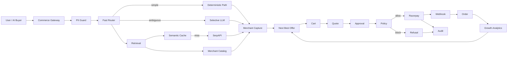

# GrowthMate — High-Level Design (HLD)

## 1. Purpose

This HLD defines the modules, ownership boundaries, coarse data flow, interfaces, non-functional requirements, and deployment design for the target GrowthMate system.

The implementation should remain a modular monolith for the hackathon.

---

## 2. Core User Journeys

### Journey A — Conversational purchase

```text
Buyer: I need running shoes under ₹2500.
  ↓
Fast intent classifier
  ↓
Merchant retrieval and/or live discovery
  ↓
Merchant Capture Engine
  ↓
Top merchant options
  ↓
Buyer selects product
  ↓
Next Best Offer Engine
  ↓
Cart
  ↓
Quote
  ↓
Explicit approval
  ↓
Guardrails
  ↓
Razorpay test-mode payment link/order
  ↓
Webhook/order update
```

### Journey B — AI buyer

```text
AI Buyer
  ↓
/.well-known/agent-commerce.json
  ↓
/agent/discover
  ↓
/agent/quote
  ↓
approval token / approval state
  ↓
/agent/checkout
  ↓
Razorpay
  ↓
/agent/order/{id}
```

### Journey C — Graceful failure

```text
Buyer request
  ↓
SerpAPI failure
  ↓
semantic cache lookup
  ↓
merchant-only fallback
  ↓
clear reduced-confidence response
```

### Journey D — Guardrail failure

```text
Checkout preview ₹3493
  ↓
Buyer approves
  ↓
Quote valid
  ↓
Guardrail detects buyer_agent limit ₹3000
  ↓
BLOCK
  ↓
No Razorpay call
  ↓
Audit row
  ↓
Clear refusal + recovery option
```

---

## 3. Module Decomposition

### 3.1 Presentation Layer

Responsibilities:

- chat UI
- audit viewer
- render recommendation cards
- render checkout preview
- display block/fallback messages

Must not:

- compute price
- decide payment eligibility
- call Razorpay directly

### 3.2 Commerce Gateway

Responsibilities:

- request validation
- authentication/actor validation for demo scope
- API routing
- request IDs / trace IDs
- consistent error responses

Must not:

- contain product ranking logic
- directly manipulate payment rules

### 3.3 Input Protection Layer

Responsibilities:

- PII detection
- secret detection
- redaction for logs
- request normalization

### 3.4 Intent Router

Responsibilities:

- detect intent
- classify domain/category
- complexity
- risk
- action
- whether live search is needed
- confidence score

Preferred order:

```text
rules/patterns → local semantic classifier → one LLM call when ambiguous
```

### 3.5 Session State Manager

Responsibilities:

- preserve compact state between requests
- store intent
- requirements
- selected merchant SKU
- offer state
- cart version
- quote state
- approval state

Avoid sending entire raw history to the LLM unless needed.

### 3.6 Merchant Retrieval Layer

Responsibilities:

- semantic merchant product retrieval
- hard metadata filters
- inventory-aware candidate generation

### 3.7 External Discovery Layer

Responsibilities:

- semantic cache lookup
- SerpAPI invocation
- source fallback
- normalization
- deduplication
- freshness handling

It should never decide the final payable SKU.

### 3.8 Merchant Capture Engine

Responsibilities:

- map market intent to merchant SKU
- score candidates
- explain merchant selection
- expose reason codes

### 3.9 Next Best Offer Engine

Responsibilities:

- find complements
- estimate acceptance probability
- estimate contribution margin
- enforce friction budget
- select at most bounded number of offers

### 3.10 Commerce Engine

Responsibilities:

- cart mutation
- cart validation
- cart total
- quote creation
- quote hash
- checkout preparation

### 3.11 Policy Engine

Responsibilities:

- explicit approval validation
- quote integrity
- cart hash
- amount limits
- actor limits
- session limits
- velocity checks if implemented

### 3.12 Payment Adapter

Responsibilities:

- Razorpay API integration
- payment link/order creation
- SDK error normalization
- idempotency where supported

### 3.13 Webhook Processor

Responsibilities:

- verify signature
- update order/payment status
- emit analytics event

### 3.14 Audit/Observability

Responsibilities:

- pipeline audit
- policy decision audit
- latency spans
- error detail
- recommendation scores
- retrieval source
- cache status
- payment references

---

## 4. High-Level Data Flow



---

## 5. State Ownership

The source of truth for each field is:

| State | Owner |
|---|---|
| buyer message | request layer |
| structured requirements | intelligence/router |
| merchant product details | DB |
| external candidate details | external discovery/cache |
| cart | commerce engine + DB |
| cart total | commerce engine |
| quote | quote repository |
| approval | policy/approval engine |
| transaction limit | policy configuration |
| payment reference | Razorpay adapter + DB |
| order status | DB + webhook processor |
| audit | audit repository |

LLM-generated content is never the source of truth for money state.

---

## 6. Data Stores

### SQLite tables / logical records

1. `products`
2. `external_product_listings`
3. `cart_items`
4. `orders`
5. `order_items`
6. `cart_events`
7. `audit_log`
8. `session_state`
9. `search_cache`
10. `quotes`
11. `offer_events`

Additional columns may be collapsed into existing tables if implementation complexity is too high, but the logical concepts must exist.

---

## 7. API Surface

### Existing

```text
GET  /health
GET  /catalog
POST /chat
GET  /audit
POST /webhook/razorpay
```

### Target additions

```text
GET  /.well-known/agent-commerce.json
POST /agent/discover
POST /agent/quote
POST /agent/checkout
GET  /agent/order/{order_id}
GET  /metrics/latency
```

### API contract principles

- Pydantic request/response models
- deterministic error semantics
- no secrets in responses
- no raw model chain-of-thought returned to clients
- approval and payment responses expose reasons, not hidden reasoning

---

## 8. Accuracy Strategy

Accuracy should come from layered constraints:

```text
semantic recall
    ↓
hard metadata filtering
    ↓
feature matching
    ↓
merchant economics
    ↓
confidence threshold
    ↓
clarification / fallback
```

The system should never trade correctness for cache hits when:

- checkout price is affected
- inventory availability is critical
- policy state changed
- external result is stale beyond configured TTL

---

## 9. Latency Strategy

### Avoided latency

- unnecessary Gemini calls
- sequential independent network calls
- repeated SerpAPI queries
- large conversation payloads
- remote calls for deterministic operations

### Parallelized latency

Run in parallel where no dependency exists:

```text
merchant semantic retrieval
external cache lookup
candidate metadata fetch
```

The live SerpAPI request should begin only when the router determines it is justified and no sufficient cache exists.

### Stage budgets

Use configured soft budgets:

```text
router:                50–100 ms target
merchant retrieval:    50–150 ms target
semantic cache:        20–80 ms target
SerpAPI:               dependency-dominated
LLM:                   dependency-dominated and measured
DB write:              < 50 ms target for demo workload
```

These are engineering targets, not correctness requirements. Benchmark locally and on the actual deployment platform.

---

## 10. Explainability Model

Every recommendation should expose:

- selected product
- score
- 2–4 reason codes
- budget fit
- stock status
- market relation if relevant

Every money action should expose:

- quote ID
- cart total
- actor
- approval status
- policy result
- reason for block/allow
- payment reference if executed

Never expose hidden model chain-of-thought.

---

## 11. Observability Model

Each stage produces an event envelope:

```json
{
  "trace_id": "...",
  "session_id": "...",
  "stage": "merchant_capture",
  "duration_ms": 37,
  "status": "success",
  "confidence": 0.93,
  "cache_hit": false
}
```

Business funnel events:

```text
intent_understood
market_search
merchant_match
recommendation_shown
recommendation_selected
offer_shown
offer_accepted
cart_updated
quote_created
approval_received
guardrail_allowed
guardrail_blocked
payment_created
payment_paid
payment_failed
cart_abandoned
```

---

## 12. Scalability Position

For the hackathon:

- one process
- one database
- synchronous API semantics where safe
- async external HTTP
- no microservices

The boundaries are designed so that later extraction is possible:

```text
retrieval service
    │
growth service
    │
commerce service
    │
payment adapter
```

but these must remain modules for now.

---

## 13. Testing Strategy

### Unit tests

- classifier
- semantic cache
- ranking
- merchant capture scoring
- offer scoring
- quote hashing
- approval
- guardrails
- cart totals

### Integration tests

- chat → discovery → recommendation
- selection → merchant capture → offer
- cart → quote → approval → block
- cart → quote → approval → payment
- webhook → order state

### Failure tests

- LLM timeout
- SerpAPI timeout
- SerpAPI malformed response
- cache stale
- cache miss
- empty merchant catalog
- Razorpay failure
- quote expired
- cart changed after quote
- approval without preview
- over-limit actor

---

## 14. Demo Metrics

The demo should show three measurable outcomes:

### A. Latency

```text
before vs after
Gemini calls
SerpAPI calls
cache hit rate
P50/P95
```

### B. Merchant revenue

```text
base basket
incremental offer revenue
attach rate
conversion
```

### C. Safety

```text
approval required
policy checks
blocked payment
no Razorpay call on blocked payment
audit trail
```
