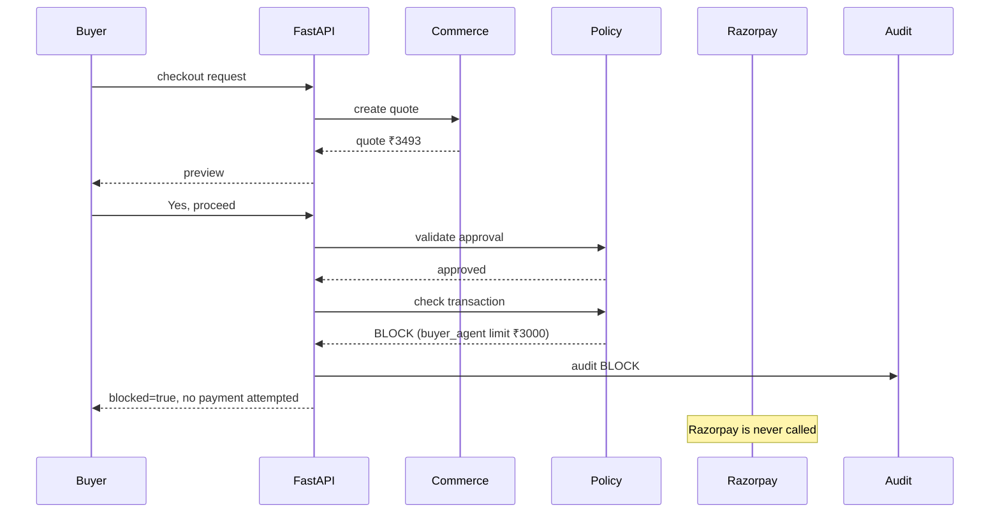
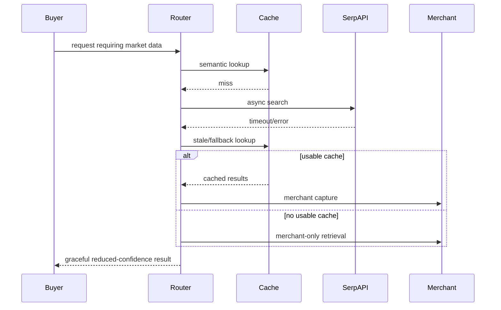

# GrowthMate — Low-Level Design (LLD)

## 1. Scope

This LLD is the implementation contract for the target architecture. It is intentionally concrete: data models, interfaces, scoring formulas, routing rules, state structure, API shapes, and sequence flows are specified here so a coding agent can implement without inventing missing core behavior.

The current repository is the starting point. Existing functionality should be preserved when compatible; otherwise update code/tests/docs consistently.

---

## 2. Python Package Structure

Recommended structure:

```text
app/
├── main.py
├── schemas.py
├── models.py
├── db.py
│
├── orchestration/
│   ├── graph.py
│   ├── router.py
│   └── state.py
│
├── intelligence/
│   ├── intent_classifier.py
│   ├── requirement_parser.py
│   ├── merchant_matcher.py
│   ├── offer_engine.py
│   └── response_composer.py
│
├── retrieval/
│   ├── merchant_retriever.py
│   ├── semantic_cache.py
│   ├── discovery.py
│   └── embeddings.py
│
├── commerce/
│   ├── cart.py
│   ├── quote.py
│   └── checkout.py
│
├── policy/
│   ├── approval.py
│   └── guardrail.py
│
├── payments/
│   └── razorpay.py
│
├── observability/
│   ├── audit.py
│   └── metrics.py
│
└── tests/...
```

A simpler flat layout is acceptable if desired, but responsibilities must remain equivalent.

---

## 3. Canonical Domain Types

### 3.1 StructuredRequirements

```python
class StructuredRequirements(TypedDict, total=False):
    intent: str
    category: str
    subcategory: str
    budget_max: float
    brand: str | None
    features: list[str]
    use_case: list[str]
    required_attributes: dict[str, str | int | float | bool]
    exclusions: list[str]
    quantity: int
    live_search_required: bool
```

### 3.2 RouteDecision

```python
class RouteDecision(TypedDict):
    intent: str
    domain: str
    category: str | None
    complexity: Literal["low", "medium", "high"]
    risk: Literal["low", "medium", "high"]
    action: str
    requires_llm: bool
    requires_live_search: bool
    requires_merchant_retrieval: bool
    confidence: float
    reason_codes: list[str]
```

### 3.3 MerchantCandidate

```python
class MerchantCandidate(TypedDict):
    sku: str
    name: str
    price: float
    currency: str
    stock: int
    category: str | None
    semantic_score: float
    requirement_score: float
    price_score: float
    inventory_score: float
    margin_score: float
    capture_score: float
    reason_codes: list[str]
```

### 3.4 OfferCandidate

```python
class OfferCandidate(TypedDict):
    sku: str
    name: str
    price: float
    quantity: int
    accept_probability: float
    incremental_margin: float
    expected_incremental_revenue: float
    friction_penalty: float
    reason_codes: list[str]
```

---

## 4. Session State

Replace broad transient-only state with a compact state object.

```python
class GrowthMateState(TypedDict, total=False):
    trace_id: str
    session_id: str
    actor: str
    last_user_message: str
    structured_requirements: dict
    route_decision: dict
    clarification_question: str | None
    discovery_results: list[dict]
    merchant_candidates: list[dict]
    merchant_match: dict | None
    offer_candidates: list[dict]
    selected_product: dict | None
    cart_version: int
    cart_total: float
    checkout_preview: dict | None
    quote: dict | None
    approval_confirmed: bool
    spend_so_far: float
    last_decision: str | None
    last_decision_reason: str | None
    payment_state: str | None
    order_id: int | None
    tools_called: list[str]
    response: str | None
}
```

The state must not contain model hidden chain-of-thought.

---

## 5. Intent Classification

### 5.1 Fast classifier order

```text
1. normalize text
2. detect explicit command patterns
3. detect commerce intent keywords/entities
4. optional local embedding classifier
5. if confidence < threshold → lightweight LLM structured extraction
```

### 5.2 Rule examples

```text
"add X" / "remove X" / "increase quantity" → cart
"show checkout" / "total" → quote/preview
"yes, proceed" after valid preview → approval candidate
"pay" / "buy now" → purchase path, but approval still required
```

### 5.3 Confidence policy

```text
>= 0.90 → deterministic fast path
0.70–0.89 → lightweight structured LLM extraction
< 0.70 → clarification or stronger reasoning
```

Thresholds should be configuration constants and benchmarked.

---

## 6. LLM Usage Contract

Gemini is **not** the source of truth for commerce state.

Allowed LLM responsibilities:

- structured requirement extraction
- ambiguous intent resolution
- nuanced recommendation phrasing
- complex buyer request interpretation

Disallowed LLM responsibilities:

- cart total calculation
- price calculation
- inventory source of truth
- approval authorization
- transaction-limit decision
- final payment execution decision

Prefer structured JSON output with a strict schema. Do not ask Gemini for long prose if a small structured object is sufficient.

---

## 7. Merchant Retrieval

### 7.1 Candidate generation

Function:

```python
def retrieve_merchant_candidates(
    requirements: dict,
    top_k: int = 10,
) -> list[MerchantCandidate]: ...
```

Steps:

```text
requirements
  ↓
embedding text
  ↓
semantic similarity top-K
  ↓
metadata filter
  ↓
stock > 0
  ↓
budget <= budget_max when explicit
  ↓
return candidates
```

### 7.2 Semantic text

Build embeddings from:

```text
name + category + description + use_case + features + compatibility
```

Never include mutable price/inventory as the only embedding signal. Those remain metadata.

---

## 8. External Semantic Cache

### 8.1 Table

Logical columns:

```text
id
query_text
query_normalized
embedding_json
requirements_json
results_json
source
created_at
expires_at
quality_score
```

### 8.2 Lookup

```python
def semantic_cache_lookup(
    query: str,
    requirements: dict,
    similarity_threshold: float,
) -> CacheLookupResult: ...
```

Return:

```python
{
    "hit": bool,
    "fresh": bool,
    "similarity": float,
    "results": list[dict],
}
```

### 8.3 Freshness rules

Default recommendation:

- normal search cache TTL: 15–60 minutes
- product/price-sensitive data: shorter TTL
- quote/payment data: **never** use search cache as source of truth

TTL must be configuration-driven.

---

## 9. SerpAPI Adapter

Function:

```python
async def search_serpapi(
    requirements: dict,
    timeout_s: float = 5.0,
) -> list[dict]: ...
```

Requirements:

- use async HTTP client
- timeout shorter than the current 15-second blocking path
- normalize provider errors
- never leak API key to clients/logs
- return empty/failure result rather than crash caller

Provider-specific response parsing must be isolated inside this adapter.

---

## 10. Discovery Pipeline

Single service call:

```python
async def discover_market_candidates(
    requirements: dict,
) -> DiscoveryResult: ...
```

Internal steps:

```text
cache lookup
  ↓ miss
SerpAPI
  ↓
extract
  ↓
normalize
  ↓
dedupe
  ↓
hard filter
  ↓
rank
  ↓
cache successful result
```

Ranking must remain explainable.

Example market score:

```python
score = (
    0.35 * requirement_match +
    0.25 * feature_match +
    0.20 * price_affinity +
    0.10 * availability_score +
    0.10 * source_quality
)
```

Weights are configuration, not hard-coded across multiple files.

---

## 11. Merchant Capture Scoring

### 11.1 Formula

Use a normalized 0–1 score:

```python
capture_score = (
    W_SEMANTIC * semantic_score +
    W_REQUIREMENT * requirement_score +
    W_PRICE * price_score +
    W_STOCK * stock_score +
    W_MARGIN * margin_score +
    W_ATTACH * attach_score +
    W_PRIORITY * merchant_priority
)
```

Recommended starting weights:

```text
semantic       0.30
requirement    0.20
price          0.15
stock          0.10
margin         0.10
attach         0.10
priority       0.05
```

These are initial defaults. Tests must verify monotonic behavior, not merely exact weight values.

### 11.2 Hard constraints

A merchant candidate is rejected when:

- stock <= 0
- explicit max budget is violated
- explicit required attribute is absent
- product is unavailable for sale

### 11.3 Explainability

Return reason codes such as:

```text
within_budget
same_use_case
high_semantic_fit
in_stock
close_market_match
merchant_fulfillable
```

---

## 12. Next Best Offer Engine

### 12.1 Candidate generation

Candidates come from merchant catalog only.

Filter by:

- complementary category/use case
- in stock
- not already in cart
- does not violate buyer exclusions
- within friction budget

### 12.2 Score

```python
expected_incremental_revenue = (
    accept_probability * incremental_margin * inventory_confidence
    - discount_cost
    - friction_penalty
)
```

### 12.3 Friction budget

Config:

```text
MAX_OFFERS_PER_TURN = 1 or 2
MAX_ADDON_RATIO = 0.20
MIN_OFFER_CONFIDENCE = 0.55
```

The engine may return no offer.

No offer is often better than a weak offer.

### 12.4 Feedback loop

Persist:

```text
offer_shown
offer_accepted
offer_rejected
```

Use aggregate history to update the prior accept probability.

For the hackathon, a smoothed empirical probability is sufficient:

```text
P(accept | pair) =
    (accepted + alpha) / (shown + alpha + beta)
```

Use small positive priors such as alpha=1, beta=1.

---

## 13. Cart Service

### 13.1 Invariant

Only merchant SKUs are payable.

External market candidates may be represented as:

- `market_reference`
- `discovery_context`
- `comparison_item`

but not as payable `CartItem` records unless the merchant explicitly maps/authorizes them to a merchant SKU.

### 13.2 API

```python
def add_to_cart(
    session_id: str,
    sku: str,
    quantity: int,
) -> dict: ...


def remove_from_cart(
    session_id: str,
    sku: str,
) -> dict: ...


def update_quantity(
    session_id: str,
    sku: str,
    quantity: int,
) -> dict: ...


def get_cart(session_id: str) -> dict: ...


def calculate_cart_total(session_id: str) -> Decimal: ...
```

Use `Decimal` for money calculations where practical. Avoid binary floating-point arithmetic for the final payable total.

### 13.3 Cart version

Every successful mutation increments `cart_version`.

---

## 14. Quote Service

### 14.1 Quote creation

```python
def create_quote(
    session_id: str,
    actor: str,
    expires_in_s: int,
) -> dict: ...
```

Canonical cart representation should have deterministic ordering:

```json
[
  {"sku":"APP-001","quantity":2,"unit_price":"499.00"},
  {"sku":"SHOE-001","quantity":1,"unit_price":"1899.00"}
]
```

Compute:

```text
cart_hash = SHA-256(canonical_cart_json)
```

Quote must include:

```text
quote_id
session_id
actor
cart_version
cart_hash
amount
currency
created_at
expires_at
nonce
status
```

---

## 15. Approval Engine

Approval is valid only when:

1. a checkout preview exists
2. the preview points to a current quote
3. the current user message is an explicit approval
4. approval is associated with the same quote/cart version

Fail closed.

### Explicit patterns

Keep a small configurable list:

```text
yes
yes please
proceed
go ahead
confirm
approved
ok
okay
sure
```

Negation must override:

```text
no
not now
don't
do not
wait
hold on
maybe
not sure
```

Approval parsing is deterministic for the hackathon.

Do not treat a general "sounds good" from an old message as approval unless it is the current turn following a shown quote.

---

## 16. Guardrail Engine

### 16.1 Configuration

```python
MAX_PER_TRANSACTION = {
    "human": Decimal("5000.00"),
    "buyer_agent": Decimal("3000.00"),
}

MAX_PER_SESSION = {
    "human": Decimal("15000.00"),
    "buyer_agent": Decimal("5000.00"),
}

ALLOWED_ACTORS = {"human", "buyer_agent"}
```

### 16.2 Decision order

1. unknown actor → BLOCK
2. quote invalid → BLOCK
3. cart changed after quote → BLOCK
4. amount > transaction limit → BLOCK
5. session spend + amount > session limit → BLOCK
6. optional velocity policy → BLOCK
7. otherwise ALLOW

### 16.3 Pure interface

```python
@dataclass(frozen=True)
class GuardrailDecision:
    allowed: bool
    code: str
    reason: str


def check_transaction(
    actor: str,
    amount: Decimal,
    spend_so_far: Decimal,
) -> GuardrailDecision: ...
```

No DB or network access inside the pure rule function.

---

## 17. Payment Adapter

Function:

```python
def create_payment_link(
    order: Order,
) -> dict: ...
```

The payment adapter receives a backend-created order snapshot, not a model-generated amount.

### Payment flow

```text
quote valid
→ approval valid
→ guardrail allow
→ create order snapshot
→ call Razorpay
→ persist provider IDs
```

On provider failure:

```text
order.status = failed
payment reference absent or partial provider reference
return non-charge message
```

Never imply payment success merely because a payment link was created.

---

## 18. Webhook Processing

Endpoint:

```text
POST /webhook/razorpay
```

Processing:

```text
raw body
  ↓
verify signature
  ↓
parse event
  ↓
find order by payment link/provider reference
  ↓
update status
  ↓
write audit event
  ↓
write growth event
```

Must be idempotent for repeated webhook delivery.

---

## 19. API Contracts

### 19.1 Chat request

Keep backward-compatible shape where possible:

```json
{
  "session_id": "sess-123",
  "actor": "human",
  "message": "I need running shoes under 2500",
  "history": []
}
```

### 19.2 Chat response

Extend safely:

```json
{
  "session_id": "sess-123",
  "reply": "...",
  "tool_calls_made": ["merchant_retrieval"],
  "blocked": false,
  "trace_id": "trace-123",
  "latency_ms": 742,
  "confidence": 0.94,
  "cart": null,
  "quote": null,
  "offers": []
}
```

The response may omit optional fields during backward compatibility, but tests should cover the final contract.

### 19.3 Agent discover

```http
POST /agent/discover
Content-Type: application/json
```

```json
{
  "session_id": "agent-session-1",
  "actor": "buyer_agent",
  "query": "road running shoes under 2500",
  "requirements": {
    "budget_max": 2500
  }
}
```

Response:

```json
{
  "session_id": "agent-session-1",
  "recommendations": [],
  "merchant_matches": [],
  "trace_id": "..."
}
```

### 19.4 Agent quote

```json
{
  "session_id": "agent-session-1",
  "actor": "buyer_agent"
}
```

Response:

```json
{
  "quote_id": "q_123",
  "cart_hash": "...",
  "amount": "2298.00",
  "currency": "INR",
  "expires_at": "...",
  "requires_approval": true
}
```

### 19.5 Agent checkout

```json
{
  "session_id": "agent-session-1",
  "actor": "buyer_agent",
  "quote_id": "q_123",
  "approval": "approved"
}
```

The endpoint must revalidate quote/cart/approval/guardrail itself. Never trust client-side confirmation.

---

## 20. Response Composer

Use deterministic templates for structured outcomes:

### Recommendation

```text
Best match: {name} at {price}.
Why: {reason_1}; {reason_2}; {reason_3}.
```

### Merchant capture

```text
The closest match available from this merchant is {name} at {price}.
It fits your {use_case} requirement and stays within your budget.
```

### Offer

```text
A useful add-on is {offer_name} for {offer_price}.
Add it for {reason}?
```

### Guardrail block

```text
I can't complete this purchase because {reason}.
No payment was attempted.
```

LLM wording may be used for nuanced conversations, but it should not be required for normal structured results.

---

## 21. LangGraph Design

The graph should be a thin state coordinator, not a free-form agent loop.

Suggested nodes:

```text
START
 ↓
router_node
 ↓
route_action_node
 ├── clarification_node → END
 ├── discovery_node → merchant_capture_node
 ├── merchant_search_node → merchant_capture_node
 ├── cart_node → response_node
 ├── quote_node → response_node
 └── checkout_node → approval_node
                          ↓
                     guardrail_node
                       /       \
                    BLOCK      ALLOW
                      |           |
                 response       payment
                                  |
                                webhook later
                                  |
                                response
```

The graph should not repeatedly invoke the LLM merely to continue deterministic work.

---

## 22. Sequence Diagram — Normal Purchase

```mermaid
sequenceDiagram
    participant B as Buyer
    participant API as FastAPI
    participant R as Router
    participant RET as Retrieval
    participant CAP as Merchant Capture
    participant OFF as Offer Engine
    participant C as Commerce
    participant P as Policy
    participant Z as Razorpay

    B->>API: POST /chat
    API->>R: classify
    R->>RET: retrieve
    RET-->>R: candidates
    R->>CAP: match merchant SKU
    CAP-->>R: ranked merchant candidates
    R-->>API: recommendations
    API-->>B: response

    B->>API: select product
    API->>OFF: generate next-best offer
    OFF-->>API: offer
    API-->>B: offer

    B->>API: add / checkout
    API->>C: calculate cart + create quote
    C-->>API: quote
    API-->>B: checkout preview

    B->>API: explicit approval
    API->>P: validate quote + approval + limits
    P-->>API: ALLOW
    API->>Z: create payment link/order
    Z-->>API: provider reference
    API-->>B: payment link
```

---

## 23. Sequence Diagram — Guardrail Failure



---

## 24. Sequence Diagram — SerpAPI Failure



---

## 25. Audit Event Taxonomy

Use stable event types:

```text
request_received
input_redacted
intent_classified
clarification_requested
merchant_retrieval
external_cache_hit
external_cache_miss
external_search_started
external_search_completed
external_search_failed
candidate_normalized
candidate_deduplicated
candidate_filtered
recommendation_ranked
merchant_capture_scored
offer_generated
offer_shown
offer_accepted
cart_created
cart_updated
quote_created
approval_checked
guardrail_checked
payment_attempted
payment_created
payment_failed
payment_webhook_received
order_created
order_paid
order_failed
fallback_used
```

Every material event should have:

```text
session_id
actor
trace_id
stage
outcome
decision
reason
latency_ms
parameters_json (redacted)
```

Do not log secrets, raw payment credentials, or unnecessary PII.

---

## 26. Database Model Changes

### Product

Existing columns plus logical fields:

```text
unit_cost / margin_pct (optional but recommended)
merchant_priority
semantic_text
embedding
```

### ExternalProductListing

Add:

```text
query_normalized
query_embedding
retrieved_at
expires_at
freshness_score
```

### CartItem

Target rule:

```text
item_type = merchant only
```

External market information belongs in discovery/session context.

### SessionState

```text
id
session_id
actor
state_json
cart_version
updated_at
```

### SearchCache

```text
id
query_text
query_normalized
embedding_json
requirements_json
results_json
source
quality_score
created_at
expires_at
```

### Quote

```text
id
quote_id
session_id
actor
cart_version
cart_hash
amount
currency
status
nonce
created_at
expires_at
```

### OfferEvent

```text
id
session_id
base_sku
offer_sku
shown
accepted
accept_probability
expected_incremental_revenue
created_at
```

---

## 27. Idempotency

### Payment

A payment request must be tied to a unique quote/order path. Repeated calls with the same valid quote must not create multiple orders unnecessarily.

### Webhook

Repeated webhook events should be safe.

### Cart

Mutating the same operation twice due to client retry should not accidentally double quantity unless requested. Use operation IDs where practical.

---

## 28. Configuration

Add environment variables/config entries for:

```text
GEMINI_API_KEY
SERPAPI_API_KEY
RAZORPAY_KEY_ID
RAZORPAY_KEY_SECRET
DATABASE_URL
SEMANTIC_CACHE_TTL_SECONDS
SEMANTIC_CACHE_SIMILARITY_THRESHOLD
ROUTER_CONFIDENCE_FAST_PATH
ROUTER_CONFIDENCE_LLM_PATH
SERPAPI_TIMEOUT_SECONDS
MAX_OFFERS_PER_TURN
MAX_ADDON_RATIO
MIN_OFFER_CONFIDENCE
```

Never hard-code secrets.

---

## 29. Performance Instrumentation

Use `time.perf_counter()` or equivalent around:

- validation
- router
- semantic cache
- merchant retrieval
- SerpAPI
- LLM
- merchant capture
- offer engine
- DB operations
- quote
- guardrail
- Razorpay

Persist or expose metrics enough to compare before/after.

---

## 30. Test Cases

At minimum:

### Classifier

- simple purchase
- cart mutation
- checkout request
- explicit approval
- ambiguity

### Merchant capture

- exact match
- cheaper alternative
- external item not sold by merchant
- out of stock candidate
- budget exceeded

### Semantic cache

- exact query hit
- semantically similar query hit
- stale result
- low similarity miss
- corrupt cache record

### Offer engine

- high expected value offer
- no acceptable offer
- offer exceeds friction budget
- low stock candidate

### Quote

- deterministic hash
- cart mutation invalidates quote
- expired quote
- amount mismatch

### Guardrail

- unknown actor
- transaction limit
- session limit
- valid transaction
- block without Razorpay call

### Failure handling

- Gemini timeout
- SerpAPI timeout
- Razorpay exception
- malformed webhook
- duplicate webhook

---

## 31. Acceptance Criteria

The implementation is complete only when all of the following are true:

1. Simple catalog/cart queries can complete without a Gemini call.
2. Structured LLM calls return JSON, not free-form control instructions.
3. External search is skipped when a sufficiently fresh semantic cache hit exists.
4. External market candidates are not blindly charged to the merchant.
5. Merchant Capture maps buyer intent to a fulfillable merchant SKU.
6. Upsell is based on expected incremental revenue and friction controls.
7. Cart totals are deterministic and not produced by the LLM.
8. Quotes are immutable snapshots tied to a cart hash/version.
9. Approval is tied to the shown quote and current turn.
10. Guardrails run before every money action.
11. A blocked transaction never calls Razorpay.
12. SerpAPI failure results in a usable fallback response.
13. Every material decision appears in the audit trail.
14. Stage latency is measured.
15. Human and AI buyer flows share the same backend commerce engine.
16. Tests cover happy paths and at least one failure for every external dependency.

---

## 32. Implementation Status — Revision 3 deltas

The narrative above is the design intent. This table records what is actually
in the code (see PHASE_NOTES.md for the deviations and exact test counts).

| Area | Implemented | Where |
| --- | --- | --- |
| Cascade router (latency optimizer, tier 0–3) | Yes — fast paths restricted to safe cart actions; payment-adjacent phrases fail open | `app/cascade_router.py`, `app/orchestration.py` |
| Guardrail order (payment guard runs even with cascade disabled) | Yes | `app/orchestration.py` (money guard precedes the disabled early-return) |
| Catalog RAG index | Yes — deterministic on-disk k-NN, atomic, content-addressed, fail-open | `app/catalog_index.py` |
| Semantic cache wrapper | Yes — `normalize_requirements` / `cached_lookup` / `store` / `prune_expired` | `app/semantic_cache.py` |
| HMAC mandate (ALLOW-only, 5-field binding) | Yes — `MANDATE_SECRET` fail-fast at startup | `app/mandate.py`, `app/main.py`, `app/orchestration.py`, `app/commerce.py` |
| Agent-readable catalog feed | Yes — `/,well-known/agentic-catalog.json` | `app/agent_feed.py` |
| Order ledger with per-read mandate re-verification | Yes — `/,well-known/agentic-orders.json` | `app/agent_feed.py` |
| Growth-recovery agent (deterministic quantity-fit, capped, floored) | Yes — actor `system_growth_agent`, event `recovery_offer`, never executes payment | `app/growth_agent.py`, `app/main.py` |
| Order.quote_id (end-to-end mandate verification) | Yes — requires fresh DB (no migrations) | `app/models.py`, `app/commerce.py` |
| `.env.example` (referenced by AGENTS.md but previously missing) | Yes — includes `MANDATE_SECRET` + `CASCADE_*` + catalog knobs | `.env.example` |
| Cascade config (enabled/thresholds) | `CASCADE_ENABLED`, `CASCADE_TIER1_THRESHOLD`, `CASCADE_TIER2_THRESHOLD` | `app/config.py` |
| Catalog index config | `CATALOG_INDEX_PATH`, `CATALOG_INDEX_MIN_SCORE` | `app/config.py` |
| Recovery floor | `MIN_RECOVERY_AMOUNT` | `app/config.py` |

Test matrix: enabled mode 225 passed; `CASCADE_ENABLED=false` parity
218 passed + 7 skipped (`requires_cascade` marker). All offline.
